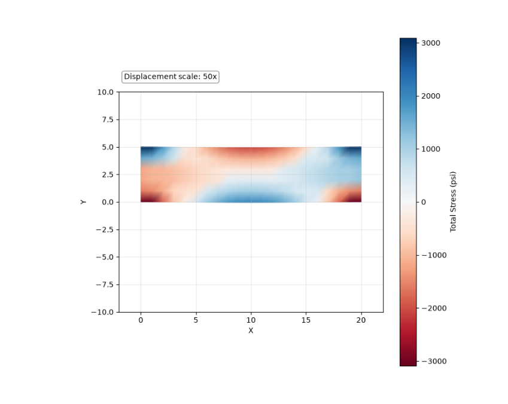
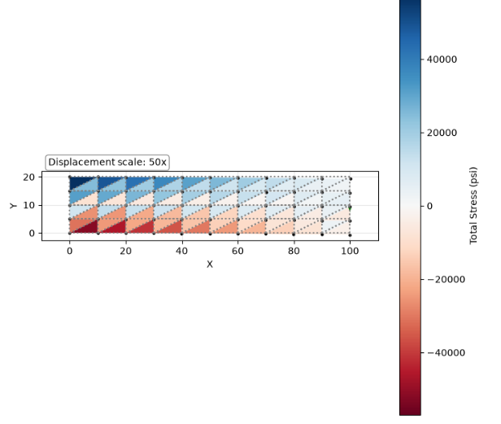
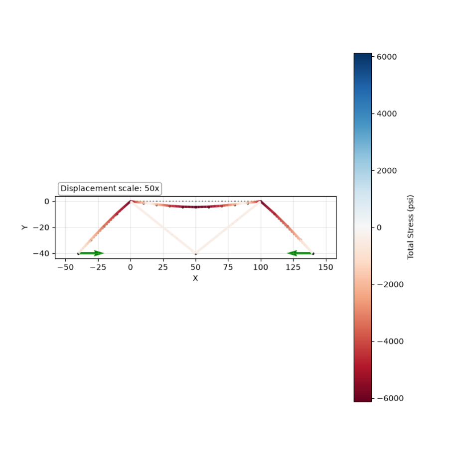
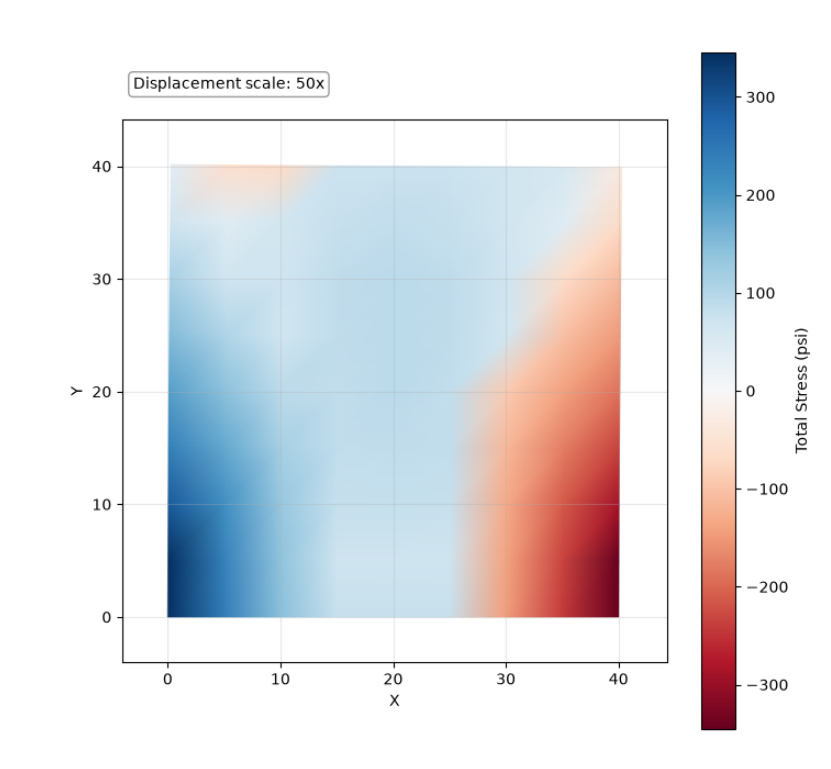

Finite Element Analysis Solver
A finite element analysis (FEA) program built from scratch in Python to model how structures deform and carry stress under load. I wrote this independently, outside of coursework, to understand the method at the level of the underlying matrix math.
Features
Truss elements — axial-only 2D members
Beam elements — axial, bending, and shear behavior, so stress can vary along a single member
CST (constant-strain triangle) elements — 2D continuum stress for triangular meshes
Bilinear quadrilateral elements — 4-node continuum elements, with a custom rectangular mesh generator
Global stiffness-matrix assembly and linear equation solver
Stress and displacement visualization via Matplotlib — color-mapped stress fields with adjustable displacement scaling
Example
```python
from FEA import Structure, solve

s = Structure()

# Define nodes: id, x, y, constraint
s.add_node(1, 0, 0, "pinned")
s.add_node(2, 50, 0, "free")
s.add_node(3, 100, 0, "pinned")

# Define a beam element: id, node1, node2, E, A, I, c, w=distributed load
s.add_beam(1, 1, 2, E=29_000_000, A=10, I=250 / 3, c=5, w=1000)
s.add_beam(2, 2, 3, E=29_000_000, A=10, I=250 / 3, c=5, w=1000)

info = solve(s)
s.plot(info)
```
Verification
Every element type was checked against hand calculations, and where possible, a benchmark problem, before being trusted:
Beam elements — closed-form deflection equations were hand-solved for a pinned beam under a uniform load and cross-checked against the solver's output.
Truss elements — reactions and member forces were benchmarked against a problem from MIT OpenCourseWare's Finite Element Analysis coursework.
Quad & CST elements — verified with symmetric and uniaxial loading cases that should (and do) produce uniform stress fields, confirming the element formulations before testing non-uniform loads.
Quad mesh under load	CST cantilever	Beam + truss frame	Shear wall panel
			
Tech Stack
Python · NumPy · Matplotlib
Limitations & Future Work
Rectangular mesh generation only — no arbitrary/imported geometry
Linear-elastic, static analysis only — no nonlinear materials, buckling, or dynamic/modal analysis
No 3D elements implemented, just 1D and 2D elements
Author
Teagan Swint — Mechanical Engineering, Johns Hopkins University
teaganswint@gmail.com · linkedin.com/in/teagan-swint
